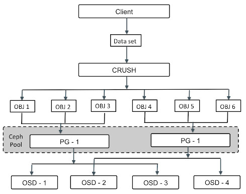

= Swift のインストール =
; ceph : BLOCK DEVICES AND OPENSTACK
: https://docs.ceph.com/en/latest/rbd/rbd-openstack/

; RedHat : Chapter 3. Configuring OpenStack to Use Ceph
: https://access.redhat.com/documentation/en-us/red_hat_ceph_storage/2/html/ceph_block_device_to_openstack_guide/configuring_openstack_to_use_ceph

; Configuring the Block (cinder) storage service (optional)
: https://docs.openstack.org/openstack-ansible-os_cinder/zed/configure-cinder.html

; Ceph Quincy : Configure Cluster #1
: https://www.server-world.info/en/note?os=Ubuntu_22.04&p=ceph&f=1

Cinder のバックエンドとしてCeph を使う設定について説明していきます。
ここでは、下記の3 ノードをCeph クラスタとして使っていきます。
下記と同様の定義を、各ノードの/etc/hosts に設定してください。

* /etc/hosts @ dev-storage01, dev-storage02, dev-storage03
```
172.22.1.101 dev-storage01 dev-storage01.openstack.example.com
172.22.1.102 dev-storage02 dev-storage02.openstack.example.com
172.22.1.103 dev-storage03 dev-storage03.openstack.example.com
```


## Ceph バックエンド
OpenStack のCinder では、Ceph のブロックデバイスをバックエンドとして、取り付けることができます。
Ceph はブロックボリュームを複数のOSD(Object Storage Daemon) に分散できるため、高い性能が期待できます。<br /><br />

Ceph をバックエンドとして利用するために、<code>libvirtd</code> をインストールする必要があります。<br /><br />

OpenStack はCeph をバックエンドにすることでImage サービス、Volume(Cinder)、ゲストディスクを統合することができますが、ここではVolume(Cinder)について、説明していきます。

## Ceph のSSH 認証設定
Ceph cluster 内で、使用するSSH 公開鍵を作成します。
代表して、dev-storage01 で作成します。

* dev-storage01
```
dev-storage01 # ssh-keygen -q -N "" -f ~/.ssh/ceph_cluster
dev-storage01 # cp ~/.ssh/ceph_cluster.pub ~/.ssh/authorized_keys
dev-storage01 # chmod 600 ~/.ssh/*
```

<code>ceph_cluster</code>(秘密鍵), <code>ceph_cluster.pub</code>(公開鍵), <code>authorized_keys</code> ファイルを、残りのノード<code>dev-storage02</code>, <code>dev-storage03</code> にコピーし、権限を<code>600</code>に設定してください。<br /><br />

<!--
# Commands in workspace. It is an additional comment for my environment.
worksptation # for target in dev-storage02 dev-storage03 dev-compute01 dev-compute02 dev-controller01; do
    echo "Copying ssh credentials to ${target}"
    ssh dev-storage01 -- sudo cat /root/.ssh/ceph_cluster | ssh ${target} -- sudo bash -c "cat - | sudo tee /root/.ssh/ceph_cluster > /dev/null"
    ssh dev-storage01 -- sudo cat /root/.ssh/ceph_cluster.pub | ssh ${target} -- sudo bash -c "cat - | sudo tee /root/.ssh/ceph_cluster.pub > /dev/null"
    ssh dev-storage01 -- sudo cat /root/.ssh/authorized_keys | ssh ${target} -- sudo bash -c "cat - | sudo tee /root/.ssh/authorized_keys > /dev/null"
    ssh ${target} -- sudo chmod 600 /root/.ssh/{ceph_cluster,ceph_cluster.pub,authorized_keys}
done
-->

次にSSH クライアント設定ファイルを作成します。

* ~/.ssh/config @ dev-storage01
```
dev-storage01 # cat << EOF > ~/.ssh/config
Host dev-storage* dev-storage*.openstack.example.com dev-compute* dev-compute*.openstack.example.com dev-controller* dev-controller*.openstack.example.com
    PreferredAuthentications publickey
    User root
    IdentityFile ~/.ssh/ceph_cluster
EOF

dev-storage01 # chmod 600 ~/.ssh/config
```

この情報を各ノードにコピーします。

```
dev-storage01 # for node in dev-storage02 dev-storage03 dev-compute01 dev-compute02 dev-controller01; do
    scp -i ~/.ssh/ceph_cluster ~/.ssh/config ${node}:.ssh/config
    ssh -i ~/.ssh/ceph_cluster ${node} -- chmod 600 .ssh/config
done
```

// Snapshot created_ssh_keys

## Ceph をインストールする

* dev-storage01
```
dev-storage01 # for node in dev-storage01 dev-storage02 dev-storage03
do
    ssh ${node} "apt update; apt -y install ceph"
done
```

## 管理ノードでMonitor daemon とManager daemon を設定する

```
dev-storage01 # uuidgen
3753f63d-338b-4f3d-b54e-a9117e7d9990
```

クラスタ設定ファイルを、監視(mon)ノード上に作成します。
ファイル名は<code>(Cluster name).confg</code> となるように設定します。

* /etc/ceph/ceph.conf @ dev-storage01
```
[global]
# specify cluster network for monitoring
cluster network = 172.22.0.0/16
# specify public network
public network = 172.22.0.0/16

# specify UUID genarated above
fsid = 3753f63d-338b-4f3d-b54e-a9117e7d9990
# specify IP address of Monitor Daemon
mon host = 172.22.1.101
# specify Hostname of Monitor Daemon
mon initial members = dev-storage01
osd pool default crush rule = -1

# mon.(Node name)
[mon.dev-storage01]
# specify Hostname of Monitor Daemon
host = dev-storage01
# specify IP address of Monitor Daemon
mon addr = 172.22.1.101
# allow to delete pools
mon allow pool delete = true
```

クラスタの監視のための秘密鍵を生成します。

* dev-storage01
```
dev-storage01 # ceph-authtool --create-keyring /etc/ceph/ceph.mon.keyring --gen-key -n mon. --cap mon 'allow *'
```

クラスタ管理のための秘密鍵を作成します。

* dev-storage01
```
dev-storage01 # ceph-authtool --create-keyring /etc/ceph/ceph.client.admin.keyring --gen-key -n client.admin --cap mon 'allow *' --cap osd 'allow *' --cap mds 'allow *' --cap mgr 'allow *'
```

起動のための秘密鍵を作成します。
```
dev-storage01 # ceph-authtool --create-keyring /var/lib/ceph/bootstrap-osd/ceph.keyring --gen-key -n client.bootstrap-osd --cap mon 'profile bootstrap-osd' --cap mgr 'allow r'
```

作成された鍵をインポートします。
```
dev-storage01 # ceph-authtool /etc/ceph/ceph.mon.keyring --import-keyring /etc/ceph/ceph.client.admin.keyring
dev-storage01 # ceph-authtool /etc/ceph/ceph.mon.keyring --import-keyring /var/lib/ceph/bootstrap-osd/ceph.keyring
```

// Snapshot imported_generated_keys

## モニタマップを作成する
```
dev-storage01 # FSID=$(grep "^fsid" /etc/ceph/ceph.conf | awk {'print $NF'})
dev-storage01 # NODENAME=$(grep "^mon initial" /etc/ceph/ceph.conf | awk {'print $NF'})
dev-storage01 # NODEIP=$(grep "^mon host" /etc/ceph/ceph.conf | awk {'print $NF'})
dev-storage01 # echo "Debug. FSID=${FSID}, NODENAME=${NODENAME}, NODEIP=${NODEIP}"
> Debug. FSID=ffffffff-ffff-ffff-ffff-ffffffffffff, NODENAME=dev-storage01, NODEIP=172.22.1.101
dev-storage01 # monmaptool --create --add $NODENAME $NODEIP --fsid $FSID /etc/ceph/monmap
```

モニタデーモンのためのディレクトリを作成します。
ディレクトリ名は<code>/var/lib/ceph/mon/<Cluster name>-<Host name></code> となるようにしてください。

```
dev-storage01 # mkdir /var/lib/ceph/mon/ceph-${NODENAME}
```

鍵とモニタマップをモニタデーモンに関連付けます。
<code>--cluster</code> オプションにはクラスタ名を指定してください。

```
dev-storage01 # ceph-mon --cluster ceph --mkfs -i $NODENAME --monmap /etc/ceph/monmap --keyring /etc/ceph/ceph.mon.keyring
dev-storage01 # chown ceph. /etc/ceph/ceph.*
dev-storage01 # chown -R ceph. /var/lib/ceph/mon/ceph-${NODENAME} /var/lib/ceph/bootstrap-osd
dev-storage01 # systemctl enable --now ceph-mon@${NODENAME}
```

Messenger v2 プロトコルを有効化します。
```
dev-storage01 # ceph mon enable-msgr2
dev-storage01 # ceph config set mon auth_allow_insecure_global_id_reclaim false
```

Placement Groups オートスケールモジュールを有効化します。
```
dev-storage01 # ceph mgr module enable pg_autoscaler
```

管理デーモンのディレクトリを作成します。

```
dev-storage01 # mkdir /var/lib/ceph/mgr/ceph-${NODENAME}
```

認証用の鍵を作成します。

```
dev-storage01 # ceph auth get-or-create mgr.${NODENAME} mon 'allow profile mgr' osd 'allow *' mds 'allow *'
[mgr.dev-storage01]
        key = ..................................

dev-storage01 # ceph auth get-or-create mgr.${NODENAME} | tee /etc/ceph/ceph.mgr.admin.keyring
dev-storage01 # cp /etc/ceph/ceph.mgr.admin.keyring /var/lib/ceph/mgr/ceph-${NODENAME}/keyring
dev-storage01 # chown ceph. /etc/ceph/ceph.mgr.admin.keyring
dev-storage01 # chown -R ceph. /var/lib/ceph/mgr/ceph-${NODENAME}
dev-storage01 # systemctl enable --now ceph-mgr@${NODENAME}
```

Ceph の状態を確認します。
monノード(監視ノード)が作成されたことが確認できます。

```
dev-storage01 # ceph osd lspools
> (No output)

dev-storage01 # ceph -s
  cluster:
    id:     ffffffff-ffff-ffff-ffff-ffffffffffff
    health: HEALTH_OK

  services:
    mon: 1 daemons, quorum dev-storage01 (age 12m)
    mgr: dev-storage01(active, since 12s)
    osd: 0 osds: 0 up, 0 in

  data:
    pools:   0 pools, 0 pgs
    objects: 0 objects, 0 B
    usage:   0 B used, 0 B / 0 B avail
    pgs:

dev-storage01 # ceph osd tree
ID  CLASS  WEIGHT  TYPE NAME     STATUS  REWEIGHT  PRI-AFF
-1              0  root default

root@dev-storage01:~# ceph df
--- RAW STORAGE ---
CLASS  SIZE  AVAIL  USED  RAW USED  %RAW USED
TOTAL   0 B    0 B   0 B       0 B          0

--- POOLS ---
POOL  ID  PGS  STORED  OBJECTS  USED  %USED  MAX AVAIL

dev-storage01 # ceph osd df
ID  CLASS  WEIGHT  REWEIGHT  SIZE  RAW USE  DATA  OMAP  META  AVAIL  %USE  VAR  PGS  STATUS
                      TOTAL   0 B      0 B   0 B   0 B   0 B    0 B     0
MIN/MAX VAR: -/-  STDDEV: 0
```

// Snapshot configure_ceph_manager_mon_node

## クラスタ(OSD:Object Storage Device)を設定する
; Ceph Quincy : Configure Cluster #2
: https://www.server-world.info/en/note?os=Ubuntu_22.04&p=ceph&f=2

管理ノードから、各ノードの<code>/dev/sdb</code> をOSD のボリュームとしてフォーマットして使います。
下記コマンドをターミナルに貼り付けて、各ノードのCephボリュームを作成します。

* create_ceph_volumes.sh @ dev-storage01
```
#!/usr/bin/env bash

for node_index in {1..3}; do
    node=$(printf "dev-storage%02d" ${node_index})

    if [ ! ${node} = "dev-storage01" ]; then
        scp /etc/ceph/ceph.conf ${node}:/etc/ceph/ceph.conf
        scp /etc/ceph/ceph.client.admin.keyring ${node}:/etc/ceph
        scp /var/lib/ceph/bootstrap-osd/ceph.keyring ${node}:/var/lib/ceph/bootstrap-osd
    fi

    ssh $node << 'EOF'
        chown ceph. /etc/ceph/ceph.* /var/lib/ceph/bootstrap-osd/*

        for drive_letter_index in d; do
            parted --script /dev/vd${drive_letter_index} 'mklabel gpt'
            parted --script /dev/vd${drive_letter_index} "mkpart primary 0% 100%"
            count=0
            while [ ${count} -lt 30 ]; do
                echo "$(date) - ${HOSTNAME} - INFO: Creating a ceph volume at /dev/vd${drive_letter_index}1 on $(uname -n)"
                ceph-volume lvm create --data /dev/vd${drive_letter_index}1
                ceph-volume lvm list
                vg_name=$(pvdisplay /dev/vd${drive_letter_index}1 | grep -P "^ *VG Name *ceph\-.*\$" | grep -o '[^ ]*$')
                if [[ "${vg_name}" =~ ^ceph\-.*$ ]]; then
                    echo "$(date) - ${HOSTNAME} - INFO: Volume group for Ceph has found. vg_name=${vg_name}."
                    break
                fi
                (( ++count ))
                echo "$(date) - ${HOSTNAME} - ERROR: Failed to create ceph volume(Obtained vg_name=${vg_name}). Retrying to execute it agin (count=${count})." >&2
                sleep 5
            done
        done
EOF
done
```

```
dev-storage01 # ./create_ceph_volumes.sh
```

クラスタの状態を確認します。
pool, osd が作成されたことがわかります。

; Ceph Placement Group
: https://www.oreilly.com/library/view/ceph-designing-and/9781788295413/b8902238-fd69-4c48-8df4-df95e34ca098.xhtml

; Our Experiences with Ceph - Part 1
: https://www.nine.ch/en/engineering-logbook/our-experiences-with-ceph-1



```
dev-storage01:~# ceph osd lspools
1 .mgr

dev-storage01 # ceph -s
  cluster:
    id:     ffffffff-ffff-ffff-ffff-ffffffffffff
    health: HEALTH_OK

  services:
    mon: 1 daemons, quorum dev-storage01 (age 45m)
    mgr: dev-storage01(active, since 45m)
    osd: 3 osds: 3 up (since 10m), 3 in (since 10m)

  data:
    pools:   0 pools, 0 pgs
    objects: 0 objects, 0 B
    usage:   0 B used, 0 B / 0 B avail
    pgs:

dev-storage01 # ceph osd tree
ID  CLASS  WEIGHT   TYPE NAME               STATUS  REWEIGHT  PRI-AFF
-1         0.02339  root default
-3         0.00780      host dev-storage01
 0    hdd  0.00780          osd.0               up   1.00000  1.00000
-5         0.00780      host dev-storage02
 1    hdd  0.00780          osd.1               up   1.00000  1.00000
-7         0.00780      host dev-storage03
 2    hdd  0.00780          osd.2               up   1.00000  1.00000

dev-storage01 # ceph df
--- RAW STORAGE ---
CLASS    SIZE   AVAIL    USED  RAW USED  %RAW USED
hdd    24 GiB  24 GiB  61 MiB    61 MiB       0.25
TOTAL  24 GiB  24 GiB  61 MiB    61 MiB       0.25

--- POOLS ---
POOL  ID  PGS   STORED  OBJECTS     USED  %USED  MAX AVAIL
.mgr   1    1  389 KiB        2  1.1 MiB      0    7.6 GiB

dev-storage01 # ceph osd df
ID  CLASS  WEIGHT   REWEIGHT  SIZE     RAW USE  DATA     OMAP  META    AVAIL    %USE  VAR   PGS  STATUS
 0    hdd  0.00780   1.00000  8.0 GiB   20 MiB  568 KiB   0 B  20 MiB  8.0 GiB  0.25  1.00    1      up
 1    hdd  0.00780   1.00000  8.0 GiB   20 MiB  568 KiB   0 B  20 MiB  8.0 GiB  0.25  1.00    1      up
 2    hdd  0.00780   1.00000  8.0 GiB   20 MiB  564 KiB   0 B  20 MiB  8.0 GiB  0.25  1.00    1      up
                       TOTAL   24 GiB   61 MiB  1.7 MiB   0 B  59 MiB   24 GiB  0.25
MIN/MAX VAR: 1.00/1.00  STDDEV: 0
```

// Snapshot created_ceph_cluster

## 各クライアントにパッケージをインストールする
; Use Block Device
: https://www.server-world.info/en/note?os=Ubuntu_22.04&p=ceph&f=3

クライアント側にssh の公開鍵を送信します。
ここでは、<code>dev-storage01</code> で作成された公開鍵を<code>dev-compute01</code>, <code>dev-compute02</code> にコピーします。
手順は割愛します。<br /><br />

次に、各クライアントに<code>ceph-common</code> をインストールし、設定していきます。

```
dev-storage01 # for node in dev-compute01 dev-compute02; do
    ssh ${node} "apt -y install ceph-common"
    scp /etc/ceph/ceph.conf ${node}:/etc/ceph/

    scp /etc/ceph/ceph.client.admin.keyring ${node}:/etc/ceph/
    ssh ${node} "chown ceph. /etc/ceph/ceph.*"
done
```

// Snapshot installed_ceph_clients

* Ceph をブロックデバイスとして使用する
* Ceph をファイルシステムとして使用する
* Ceph for OpenStack
